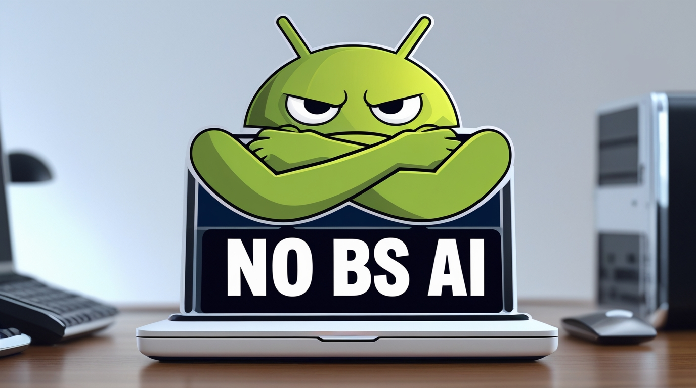

# No BS AI (System Prompt)

## Version Index

| Version | Status | System Prompt | Analysis | Metrics | JSON Format |
|---------|--------|---------------|----------|---------|-------------|
| v1.0 |  |  |  |  |  |

## About This System Prompt

This system prompt gathers together a set of instructions which are collectively intended to produce a specific type of experience with an AI agent. 

The agent is instructed to be minimal in its interactions with the user without straying into the territory of being unfriendly. 

Negative prompts are used to attempt to mitigate or better avoid unwanted behaviors in off-the-shelf mainstream commercial LLMs. 

Some output instructions are given and attempts are also made to mitigate political and geographic-centric bias.

## Author

Daniel Rosehill
(danielrosehill.com)